# Mind-Scroll Architecture Diagram

## 🏗️ System Architecture Overview

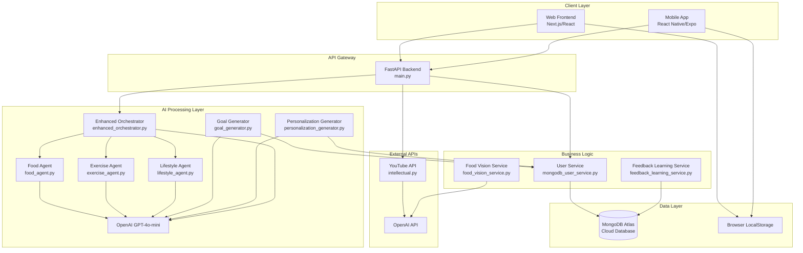

## 🎯 Core Features & File Mapping

### 1. **User Authentication & Management**

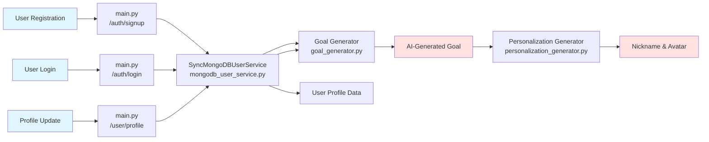

**Files Involved:**
- `src/backend/main.py` (lines 138-229): Authentication endpoints
- `src/backend/services/mongodb_user_service.py`: User CRUD operations
- `src/backend/agents/goal_generator.py`: AI goal generation
- `src/backend/agents/personalization_generator.py`: Nickname/avatar generation
- `src/backend/models/user.py`: User data models
- `src/backend/schemas/user.py`: Validation schemas
- `src/frontend/pages/signup.tsx`: Signup UI
- `src/frontend/pages/login.tsx`: Login UI
- `src/frontend/pages/profile.tsx`: Profile management

---

### 2. **Health Path - Daily Tracking & Analysis**

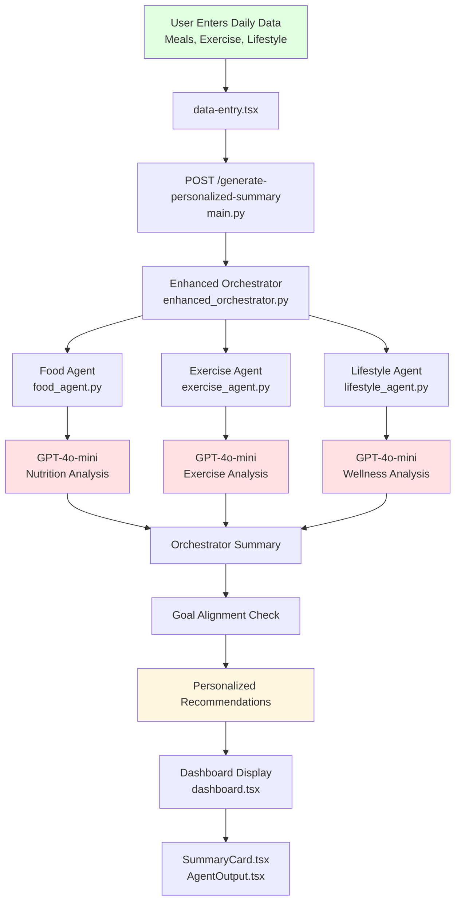

**Files Involved:**
- `src/frontend/pages/data-entry.tsx`: Data input form
- `src/frontend/pages/dashboard.tsx`: Results display
- `src/frontend/components/SummaryCard.tsx`: Summary visualization
- `src/frontend/components/AgentOutput.tsx`: Agent results display
- `src/backend/main.py` (lines 276-324): Summary generation endpoint
- `src/backend/agents/enhanced_orchestrator.py`: Coordinates all agents
- `src/backend/agents/food_agent.py`: Analyzes meals
- `src/backend/agents/exercise_agent.py`: Analyzes activities
- `src/backend/agents/lifestyle_agent.py`: Analyzes wellness factors

---

### 3. **Study Path - Intellectual Content**

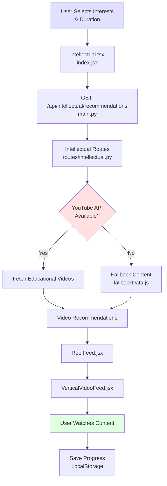

**Files Involved:**
- `src/frontend/pages/intellectual.tsx`: Study path entry
- `src/frontend/src/modules/intellectual/index.jsx`: Main intellectual module
- `src/frontend/src/modules/intellectual/InterestSelector.jsx`: Subject selection
- `src/frontend/src/modules/intellectual/DurationSelector.jsx`: Video length preference
- `src/frontend/src/modules/intellectual/ReelFeed.jsx`: Content feed
- `src/frontend/src/modules/intellectual/VerticalVideoFeed.jsx`: Video player
- `src/frontend/src/modules/intellectual/ReelCard.jsx`: Individual video card
- `src/frontend/src/modules/intellectual/fallbackData.js`: Offline content
- `src/backend/routes/intellectual.py`: YouTube API integration

---

### 4. **Food Vision - Image Recognition**

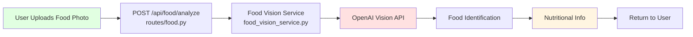

**Files Involved:**
- `src/backend/routes/food.py`: Food analysis endpoint
- `src/backend/services/food_vision_service.py`: Image processing & AI analysis

---

## 📱 Mobile App Architecture

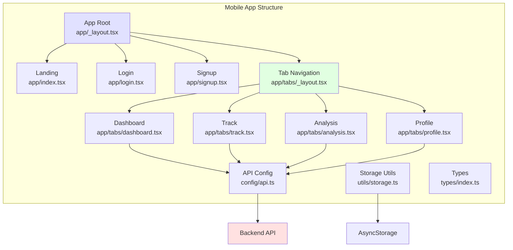

**Files Involved:**
- `src/mobile/app/_layout.tsx`: Root navigation
- `src/mobile/app/(tabs)/_layout.tsx`: Tab navigation
- `src/mobile/app/(tabs)/dashboard.tsx`: Health dashboard
- `src/mobile/app/(tabs)/track.tsx`: Daily tracking
- `src/mobile/app/(tabs)/analysis.tsx`: AI analysis view
- `src/mobile/app/(tabs)/profile.tsx`: User profile
- `src/mobile/config/api.ts`: API configuration
- `src/mobile/utils/storage.ts`: Local data storage
- `src/mobile/types/index.ts`: TypeScript definitions

---

## 🔄 Data Flow Diagrams

### User Registration Flow

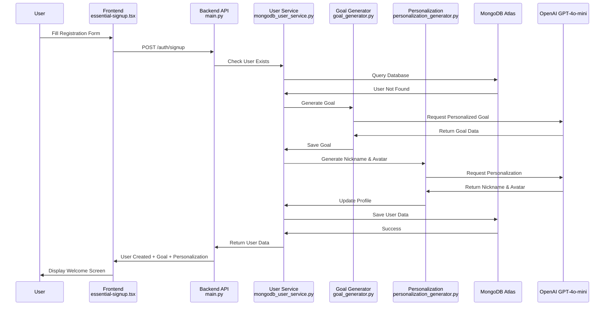

### Daily Health Analysis Flow

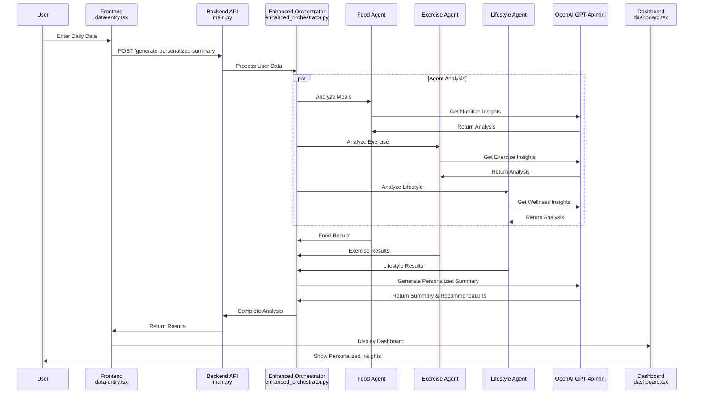

### Educational Content Flow

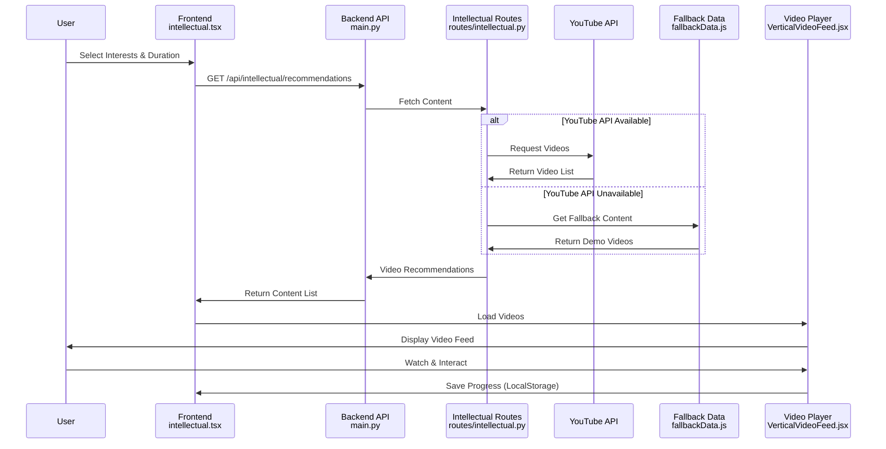

---

## 🗂️ Complete File Structure with Responsibilities

### Backend Files

| File | Primary Responsibility | Key Features |
|------|----------------------|-------------|
| `main.py` | API Gateway & Route Coordination | Authentication, Health Analysis, User Management |
| **Agents** | | |
| `enhanced_orchestrator.py` | Coordinate all AI agents | Personalized summary generation, goal alignment |
| `orchestrator.py` | Basic orchestration (legacy) | Simple agent coordination |
| `food_agent.py` | Food analysis | Meal evaluation, calorie estimation, nutrition scoring |
| `exercise_agent.py` | Exercise analysis | Activity tracking, calorie burn estimation |
| `lifestyle_agent.py` | Wellness analysis | Sleep, stress, screen time evaluation |
| `goal_generator.py` | AI goal creation | Personalized health goals based on profile |
| `personalization_generator.py` | User personalization | Nickname & avatar generation |
| **Services** | | |
| `mongodb_user_service.py` | User CRUD operations | Database interactions, user management |
| `sync_mongodb_user_service.py` | Synchronous DB operations | Blocking database calls |
| `user_service.py` | Legacy local storage (JSON) | File-based user management |
| `food_vision_service.py` | Image recognition | Food photo analysis with OpenAI Vision |
| `feedback_learning_service.py` | Learning from feedback | User feedback processing |
| **Routes** | | |
| `routes/intellectual.py` | Educational content | YouTube API integration, content recommendations |
| `routes/food.py` | Food analysis endpoints | Image upload, nutrition analysis |
| **Models & Schemas** | | |
| `models/user.py` | Database models | MongoDB document structure |
| `schemas/user.py` | Validation schemas | Request/response validation |
| `schemas/summary.py` | Summary data structures | Health summary format |
| **Database** | | |
| `database/mongodb.py` | Database configuration | MongoDB connection setup |

### Frontend Files

| File | Primary Responsibility | Key Features |
|------|----------------------|-------------|
| **Pages** | | |
| `pages/index.tsx` | Landing page | Welcome screen, navigation |
| `pages/signup.tsx` | User registration | Account creation form |
| `pages/essential-signup.tsx` | Detailed signup | Multi-step registration |
| `pages/login.tsx` | Authentication | User login form |
| `pages/path-selection.tsx` | Path chooser | Health vs Study path selection |
| `pages/goal-homepage.tsx` | Goal display | AI-generated goals showcase |
| `pages/data-entry.tsx` | Daily tracking | Meal, exercise, lifestyle input |
| `pages/dashboard.tsx` | Health dashboard | AI analysis results display |
| `pages/intellectual.tsx` | Study path | Educational content access |
| `pages/profile.tsx` | User profile | Profile viewing/editing |
| `pages/comprehensive-profile.tsx` | Detailed profile | Extended profile management |
| **Components** | | |
| `components/Navbar.tsx` | Navigation bar | Header with user controls |
| `components/SummaryCard.tsx` | Summary display | Health score visualization |
| `components/AgentOutput.tsx` | Agent results | Individual agent output display |
| **Intellectual Module** | | |
| `modules/intellectual/index.jsx` | Main module entry | Intellectual path coordinator |
| `modules/intellectual/InterestSelector.jsx` | Interest picker | Subject selection UI |
| `modules/intellectual/DurationSelector.jsx` | Duration picker | Video length preference |
| `modules/intellectual/ReelFeed.jsx` | Content feed | Scrollable video feed |
| `modules/intellectual/ReelCard.jsx` | Video card | Individual video display |
| `modules/intellectual/VerticalVideoFeed.jsx` | Video player | TikTok-style player |
| `modules/intellectual/fallbackData.js` | Demo content | Offline video data |
| **Utils** | | |
| `utils/api.ts` | API communication | Backend integration |

### Mobile App Files

| File | Primary Responsibility | Key Features |
|------|----------------------|-------------|
| `app/_layout.tsx` | Root navigation | App structure setup |
| `app/index.tsx` | Landing screen | Welcome & navigation |
| `app/login.tsx` | Mobile login | Authentication |
| `app/signup.tsx` | Mobile signup | Registration |
| `app/(tabs)/_layout.tsx` | Tab navigation | Bottom tab setup |
| `app/(tabs)/dashboard.tsx` | Mobile dashboard | Health metrics display |
| `app/(tabs)/track.tsx` | Mobile tracking | Daily data entry |
| `app/(tabs)/analysis.tsx` | Mobile analysis | AI insights view |
| `app/(tabs)/profile.tsx` | Mobile profile | User settings |
| `config/api.ts` | API configuration | Backend endpoints |
| `utils/storage.ts` | Local storage | AsyncStorage wrapper |
| `types/index.ts` | Type definitions | TypeScript types |

---

## 🎨 Feature Map

### Health Path Features

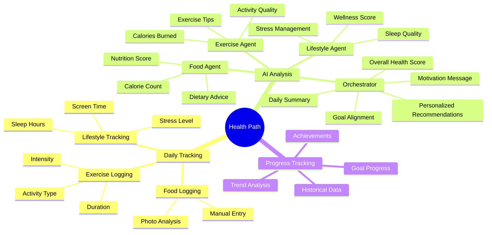

### Study Path Features

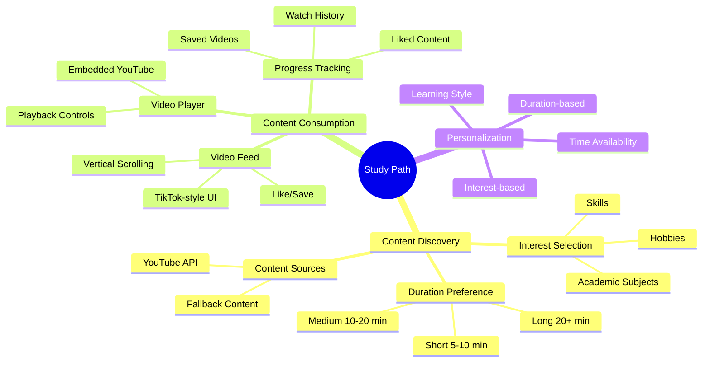

### User Management Features

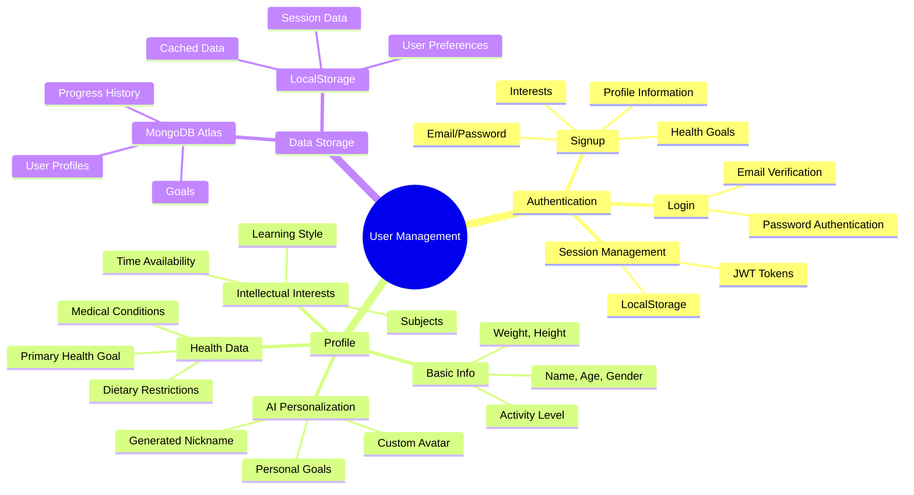

---

## 🔐 Security & Data Flow

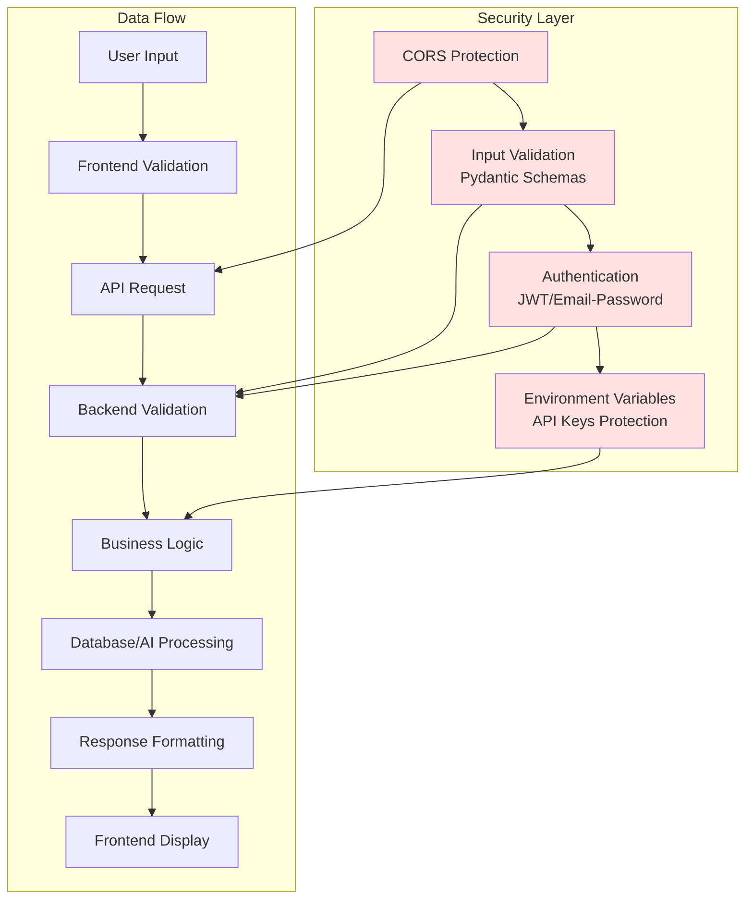

---

## 🚀 Deployment Architecture

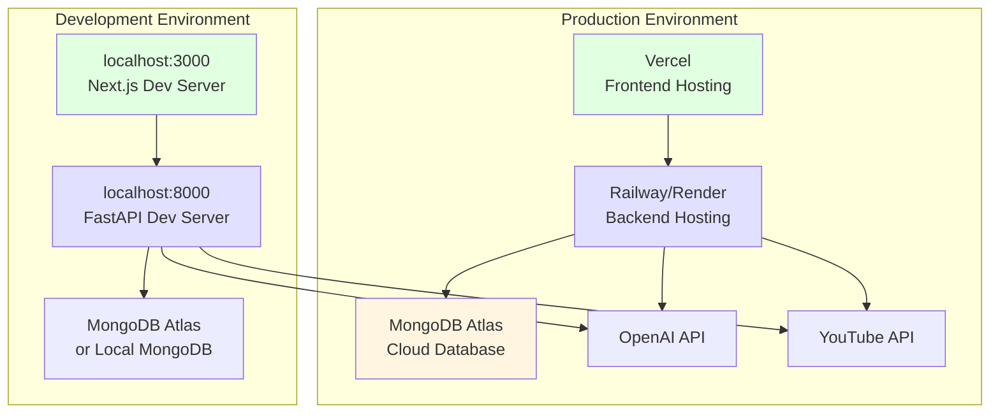

---

## 📊 Technology Stack

| Layer | Technologies | Purpose |
|-------|-------------|---------|
| **Frontend Web** | Next.js, React, TypeScript, TailwindCSS | Responsive web interface |
| **Frontend Mobile** | React Native, Expo, TypeScript | Native mobile apps |
| **Backend** | FastAPI, Python 3.8+, Uvicorn | REST API server |
| **AI/ML** | LangChain, OpenAI GPT-4o-mini | Natural language processing |
| **Database** | MongoDB Atlas, PyMongo, Motor | Cloud data storage |
| **External APIs** | YouTube Data API v3, OpenAI API | Content & AI services |
| **Authentication** | JWT, Pydantic | Secure user sessions |
| **Deployment** | Vercel, Railway, Docker | Production hosting |

---

## 🎯 Key Architectural Decisions

### 1. **Microservices-Inspired Agent Architecture**
- Each agent (Food, Exercise, Lifestyle) is independent
- Orchestrator coordinates agents without tight coupling
- Easy to add new agents or modify existing ones

### 2. **Dual Storage Strategy**
- **MongoDB Atlas**: Production user data, goals, progress
- **LocalStorage**: Client-side caching, session management
- Enables offline functionality and reduces API calls

### 3. **Dual Path System**
- **Health Path**: Physical wellness tracking
- **Study Path**: Educational content consumption
- Unified user experience with separate feature sets

### 4. **AI-First Approach**
- Goal generation powered by GPT-4o-mini
- Personalized recommendations based on user context
- Natural language analysis for health insights

### 5. **Fallback Systems**
- Fallback content when YouTube API fails
- Basic calculations when AI is unavailable
- Graceful degradation ensures system reliability

### 6. **Mobile-First API Design**
- RESTful endpoints work for web and mobile
- JSON responses for easy parsing
- CORS enabled for cross-platform access

---

## 📈 Future Architecture Enhancements

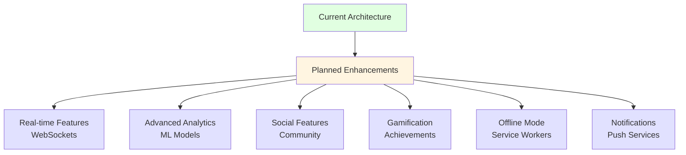

---

## 🔑 Key Takeaways

### Architecture Strengths
✅ **Modular Design**: Easy to maintain and extend  
✅ **AI-Powered**: Personalized user experience  
✅ **Scalable**: Cloud-native with MongoDB Atlas  
✅ **Flexible**: Dual path system for different user needs  
✅ **Cross-Platform**: Web, mobile, and API support  
✅ **Resilient**: Fallback mechanisms for reliability  

### Component Responsibilities
- **Backend**: Business logic, AI processing, data management
- **Frontend Web**: Desktop/tablet user interface
- **Frontend Mobile**: Native mobile experience
- **AI Agents**: Specialized analysis and recommendations
- **External APIs**: Extended functionality (videos, advanced AI)

---

**Document Version**: 1.0  
**Last Updated**: November 2024  
**Generated For**: Mind-Scroll Architecture Understanding

